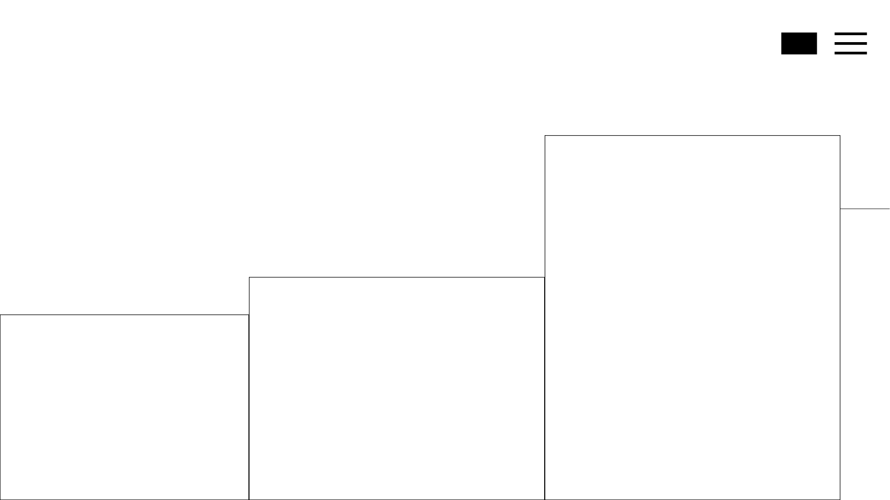
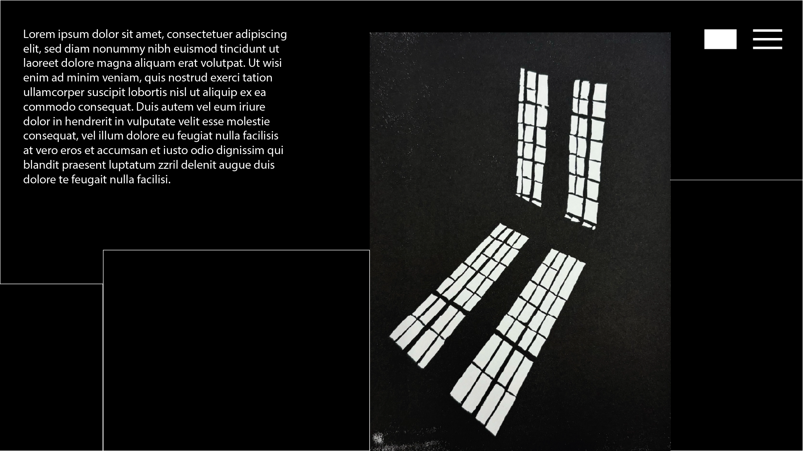

# Final Project

### Summary of the project 

This project is a portfolio website designed as an interactive gallery experience. When entering the site, visitors will see a grid of empty boxes. As the user hovers over each box, the corresponding artwork and accompanying text are revealed. The navigation is horizontal: users can scroll down vertically or move laterally by directing their cursor toward the right edge of the screen. All of these functions would be smooth. Additionally, visitors can access an About Me page by the menu icon, represented by three lines, in the top right corner of the screen. This section provides my background information. A dark mode feature is also available, allowing users to invert the color scheme for a visually distinct and more comfortable viewing option.

### What I've learned and how I've grown

Over the course of the semester, I’ve gained a solid foundation in HTML, CSS, and JavaScript, which has completely changed the way I approach web development. When I started, I wasn’t confident in building a website from scratch, but now I feel comfortable creating fully functional, visually engaging sites, not just for myself, but for others as well. I’ve learned how to structure content, style layouts, and add interactivity through code, and more importantly, I’ve become confident in my ability to troubleshoot and research new techniques or functions when I run into something I don’t already know. This experience has made me feel like a capable website developer, and made me ready to take on real-world projects.

### JavaScript elements that I will implement 

1. Hover reveal effects: I would use JavaScript to detect when a user hovers over a box and trigger fade-ins for the artwork and accompanying text.

2. Horizontal scroll on mouse movement: I would use Javascript to track the mouse position to smoothly scroll the gallery horizontally when the cursor goes near the right or left edge of the screen.

3. Dark mode toggle: I would use JavaScript to switch between light and dark mode by toggling CSS classes.

4. Responsive menu toggle: I would use Javascript to enable the "hamburger" menu to open and close an About Me section or navigation menu.

5. Smooth scrolling transitions: I would use Javascropt to implement smooth scroll behavior when navigating between sections or interacting with elements on the page.

### Design choices and inspiration 

My design approach was centered around minimalism, with the goal of creating a space that feels as clean and focused as a physical gallery. I wanted the website to reflect the tone of my artwork, so I will lean heavily into a black-and-white color palette to keep the viewer's attention on the visuals and accompanying text. The overall layout is intentionally simple—boxes reveal artwork only when hovered over—so that each piece feels like its own moment. I was especially inspired by the smooth transitions and horizontal scroll functionality of Studio Ahead’s website. 

Studio Ahead Website:

https://www.studioahead.com/ 

### Wireframes

This is what you would see when you enter the website 

This is what it would look like when you hover over a box - revealing the image 

This is the about me page 

These are wire frames of what it would look like in dark mode 

### Pseudo code for the home screen

Variables:

let gridBoxes = all boxes in the homepage gallery grid 
let darkModeButton = the button for toggling dark mode
let menuButton = hamburger icon in the top right corner 

On page load:
Set theme to light 
For each gridBox:
    Set artworkImage.visability = hidden 
    Set artworkText.opacity = 0

Hover effects for grid boxes 
For each gridBox:
    On mouseEnterBox:
        Fade in artworkImage, set visibility = visible
        Fade in artworkText, set opacity = 1
    On mouseLeaveBox:
        Fade out artworkImage 
        Fade out artworkText

Horizontal scroll with mouse 
On mouseMove:
    If cursor is within 50px of the right edge of the screen:
        Scroll container to the right 
    Else if cursor is within 50 px of the left edge of the screen:
        Scroll container to the left 

Vertical scroll to horizontal scroll (Chatgpt helped)
On window scroll event:
    Prevent the default vertical scroll behaviour 
    Calculate scrollDelta from trackpad
    Set galleryContainer.scrollLeft += scrollDelta 

Dark mode 
On darkModeButton click
    If current theme is light:
        Set body.class = dark-mode
        Save preference to localStorage
    If current theme is dark:
        Set body.class = light-mode
        Save preference to localStorage

Hamburger menu 
On menuButton click:
    Display about page with slide in animation 

